## Video
[](https://www.youtube.com/watch?v=ClSQaUo3G7c "BoringAI video")


## Project Summary
In Minecraft, certain tools mine through blocks faster than others (i.e. pickaxes destroy stone-blocks faster than shovels). We aim to train a Minecraft agent using deep reinforcement learning to dig to the end of a tunnel as fast as possible, by learning what tools are best for each material it encounters. Ideally, our AI will learn to use the proper tool to destroy the block, for maximum tunneling speed.

For our prototype, we concentrated on just switching to the right tool. To do so, we limited our malmo environment to discrete movements and dense rewards. For our finished project, we used sparse rewards based on time, and added durability values for each tool; we gave tools made out of diamond lower durability than tools made out of gold. Our goal was for the agent to learn to save the diamond tools for cases where it would mine faster than gold tools.  

Our evaluation will focus on phase 2 which has the most data and observations. Our phase 2 goes into more detail since our moonshot case, phase 3, doesn’t have enough data (couldn’t be run long enough in the time period) to come to  any significant conclusions.

## Approaches

<p align="center">
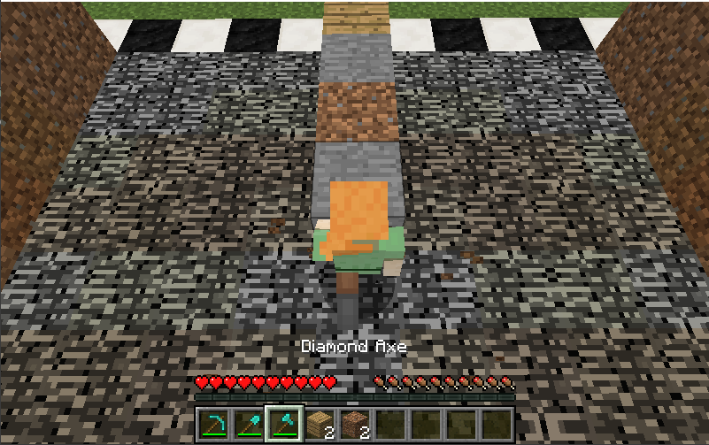
</p>

### Phase 1: Dense rewards and Discrete Movements (Prototype) 
For each mission, our agent spawned with 9 blocks lined in front of him as seen in the picture above. To complete the mission, he had to reach the finish line by destroying the blocks in front of him, using one of the tools in the hotbar ( shovel or pickaxe).  

To train our agent, we implemented a deep reinforcement learning algorithm, DQN, from the PyTorch library. Since our AI was bulldozing through in a straight line, our action space was limited to choosing between a diamond pickaxe and diamond shovel. When the agent encountered a block in front of itself, it had to decide which tool to use. Afterwards, the agent followed a command sequence, breaking the block and moving forward. The agent repeated this cycle until it reached the end of the tunnel, which was denoted by a coal block. Our observation state included the 3x3 block space surrounding the agent. 

In our prototype, we had 2 different tools (pickaxe and shovel) with 2 different blocks (dirt and stone). For our prototype’s reward function, we used dense rewards, giving direct rewards at each step (+10 for using the right tool, -10 for not).

```
if get_block_front(world_state) == 'dirt':
                if action_idx == 0: # switching to pickaxe
                    reward += -10
                else:
                    reward += 10
elif get_block_front(world_state) == 'stone':
                if action_idx == 1: #switching to shovel
                    reward += 10
                else:
                    reward += -10
```

### Phase 2: Sparse rewards and Continuous Movement 
For each mission, our agent is spawned with an equal amount of each block type (e.g. 3 blocks each of dirt, stone, and planks). The tools in the agent’s action space consists of a diamond pickaxe, diamond axe, and diamond shovel. 

We decided to switch to sparse rewards to increase the complexity of our problem, and promote learning for our AI. We switched to continuous movement in order to make better use of time in the calculation of the reward. With discrete movement, the agent would break a block within one hit regardless of its tool. However, with continuous movement, it would take multiple hits even with the optimal tool to break a block. This allows us to naturally reward our model based on how fast it digs through the tunnel.

In terms of setup, we tried two different algorithms in our model. For one, we used PPOTrainer from RLlib and for the second, we used DQNTrainer from RLlib. In addition, we experimented with different tunnel lengths, 9 blocks and 21 blocks, in order to figure out if tunnel length has any effect on the training rate. 

#### Proximal Policy Optimization (PPO)
PPO uses gradient descent to optimize a policy that aims to maximize the reward. Below is the pseudocode for the ppo algorithm. 
<p align="center">
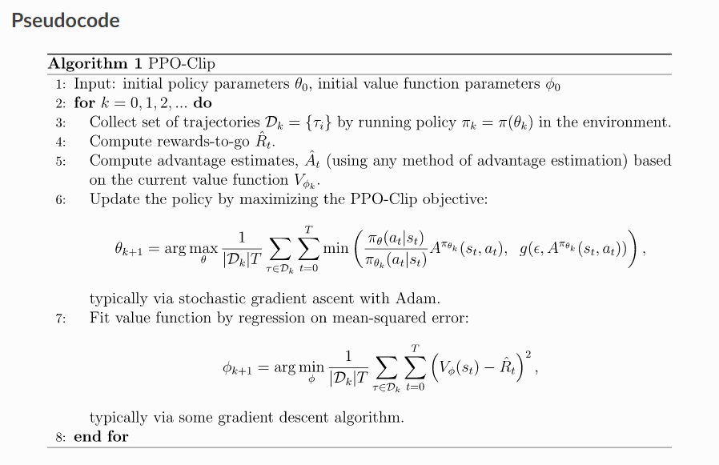  
</p>
<div style="text-align: right;"><a href = "https://spinningup.openai.com/en/latest/algorithms/ppo.html">image source</a></div>

We chose PPO since it was easy to implement and performed fairly well. PPO starts off by randomly choosing actions in the action space. As it trains longer, it exploits rewards that it has already discovered. An example of this in our AI is when the agent learns that using a pickaxe to mine a stone block takes less time than using either an axe or shovel. This experience motivates the AI to choose this tool in its future encounters with a stone block, so that its reward is maximized.

#### Deep Q Network (DQN)
DQN combines Q-Learning with Deep Neural Networks to optimize a policy that aims to maximize the reward. Below is the pseudocode for the dqn algorithm. 
<p align="center">
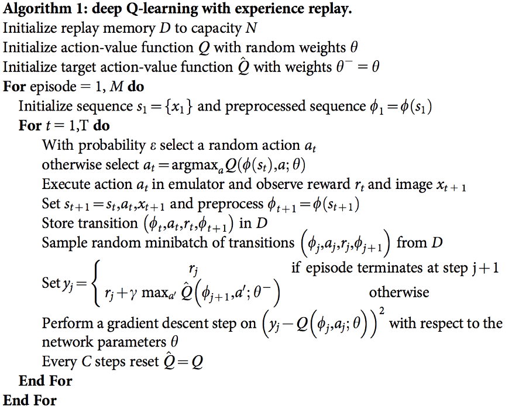  
</p>
<div style="text-align: right;"><a href = "https://storage.googleapis.com/deepmind-media/dqn/DQNNaturePaper.pdf">image source</a></div>

We chose DQN for our secondary model in order to compare PPO’s performance to a more familiar algorithm. DQN was available in the same library and also a plausible good algorithm to use. One advantage of using DQN is that it is more stable when training. One disadvantage is that the DQN uses more memory than PPO as it requires more space to maintain values in its q-table.  

### Phase 3: Durability
For phase 3, we attempted to incorporate one of our moonshots; durability. To start off, we added a new material type (gold) for each tool that is faster than its diamond counterpart. To prevent the agent from using only the gold tools, we had it’s durability set to 2 blocks. In order to simulate this, we incurred a penalty when the particular golden tool was used more than twice. It’s maxed usage would be 6 times (twice per golden tool). To further challenge the agent, we implemented a corresponding special block(“pro block”) that is heavily penalized when trying to break with a diamond tool. The hope was to prompt the agent to “save” the golden tools for these special blocks. 

For our testing set up, the agent carries one of each tool, listed below. We also have a tunnel length of 9 with 2 normal blocks and 1 pro block of each type (e.g. 2 blocks each of dirt, stone, planks and 1 block of each of dirtPro, stonePro, and plankPro)

<p align="center">
<table style="margin:0px auto;border:2px solid #DCDCDC border-collapse:collapse;border-spacing:0;" >
<tr>
<th style="padding: 5px; border: 1px solid #DCDCDC; border-collapse: collapse;">Action Space</th>
<th style="padding: 5px; border: 1px solid #DCDCDC; border-collapse: collapse;">Observation Space</th>
</tr>
<tr>
<td style="padding: 5px; border: 1px solid #DCDCDC; border-collapse: collapse;background-color: #f2f2f2;">Diamond Pickaxe</td>
<td style="padding: 5px; border: 1px solid #DCDCDC; border-collapse: collapse;background-color: #f2f2f2;">Stone</td>
</tr>
<tr>
<td style="padding: 5px; border: 1px solid #DCDCDC; border-collapse: collapse;">Golden Pickaxe</td>
<td style="padding: 5px; border: 1px solid #DCDCDC; border-collapse: collapse;">StonePro</td>
</tr>
<tr>
<td style="padding: 5px; border: 1px solid #DCDCDC; border-collapse: collapse;background-color: #f2f2f2;">Diamond Shovel</td>
<td style="padding: 5px; border: 1px solid #DCDCDC; border-collapse: collapse;background-color: #f2f2f2;">Dirt</td>
</tr>
<tr>
<td style="padding: 5px; border: 1px solid #DCDCDC; border-collapse: collapse;">Golden Shovel</td>
<td style="padding: 5px; border: 1px solid #DCDCDC; border-collapse: collapse;">DirtPro</td>
</tr>
<tr>
<td style="padding: 5px; border: 1px solid #DCDCDC; border-collapse: collapse;background-color: #f2f2f2;">Diamond Axe</td>
<td style="padding: 5px; border: 1px solid #DCDCDC; border-collapse: collapse;background-color: #f2f2f2;">Plank</td>
</tr>
<tr>
<td style="padding: 5px; border: 1px solid #DCDCDC; border-collapse: collapse;">Golden Axe</td>
<td style="padding: 5px; border: 1px solid #DCDCDC; border-collapse: collapse;">PlankPro</td>
</tr>
</table>
</p>

In short, on top of our original reward system (blocks/min) that was calculated based on the tunnel length and total number of ticks, we added “durability”. The golden tools had a penalty of an additional 200 ticks if it was used more than twice and the diamond tools had a penalty of an additional 200 ticks when used for pro blocks. 

## Evaluation

### Quantitative

#### Blocks Per Minute
Evaluation was difficult with the original reward system. “Raw” rewards, (the rewards Malmo directly sends the agent) can be graphed and show training progress relative to just the current run. But if any of the hyperparameters such as tunnel length or initial reward get changed, it becomes troublesome to compare. Thus, giving the AI a reward based on blocks per minute helped us standardize this problem. 

Here’s the formula we use to convert “raw” rewards to Blocks Per Minute:
<p align="center">
 
</p>

Using this, we can change the number of blocks or the initial reward while still being able to compare performance between runs. The graphs below use this metric.

**PPO vs DQN Returns** \
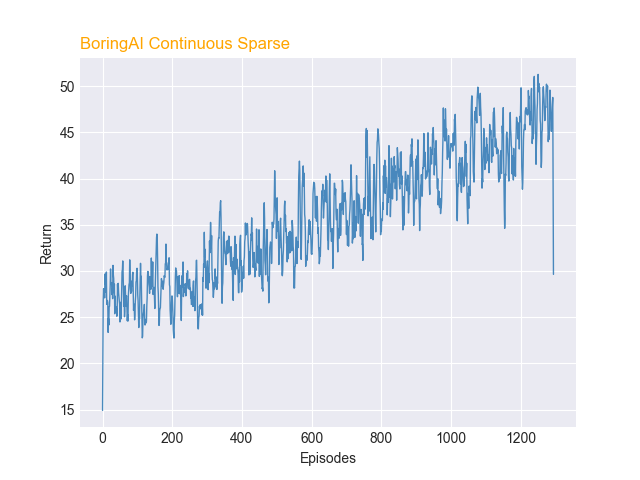 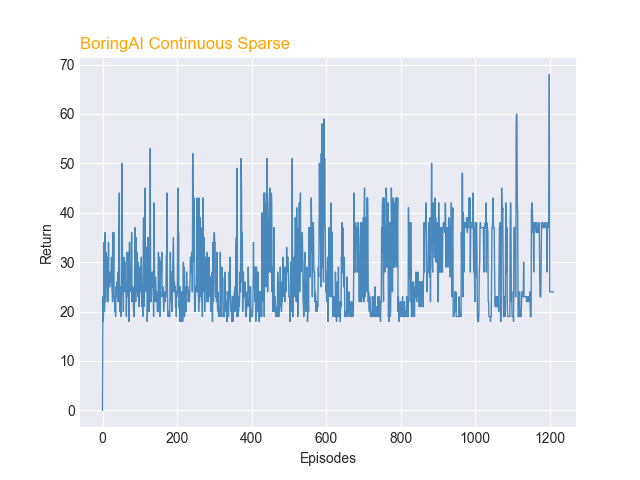  

#### Tunnel Length
**Q**: Did the length of the tunnel have any effect on the speed of training?  
As shown in the graph below, the 21-block tunnel was more difficult for the agent to learn. Although we do see improvement over the long run, this experiment told us that, in order to train quickly, we would have to keep episodes short, or figure out a curriculum that ramped up to longer tunnels.

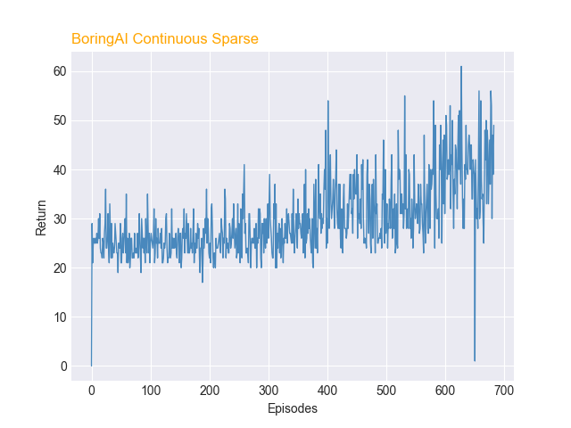  

#### PPO vs DQN: Which One Did Better?
PPO seemed to perform better thanDQN based on the graph of its rewards and toolstats. The average return for both models at episode 0 was around 24. However, after 700 episodes, the average return for PPO was near 40, whereas the average return for DQN was near 32. This shows that the PPO agent learned at a faster rate than the DQN agent. Furthermore, data from the tool usage graph of PPO and DQN showed that after 700 episodes, the percentage correctly used for the diamond pickaxe was 39% and diamond axe was 36% for PPO. These were higher percentages than that of the DQN agent, which both used the diamond pickaxe and axe around correctly 31% of the time. Both agents had similar performance on using the diamond shovel at around 34% correct-usage-rate. 

#### Results of adding Durability 
From the results of PPO and DQN in the previous section, we decided to use PPO for training the AI to learn to use less durable tools (gold tools) before using the more durable tools (diamond tools). Adding durability vastly increased the complexity of the problem and slowed down the learning rate of our PPO agent. At episode 0, the average return of the agent was 12, and at episode 1200, the average return of the agent was 15. At episode 0, the AI picked tools randomly, but at around episode 200, the AI started to start using all tools (except diamond pickaxe) at around 20% used correctly. At episode 1200, The agent used the diamond tools slightly more correctly than the gold tools. We believe that this is due to the nature of the diamond tools being heavily penalized when used against pro blocks. All diamond tools had a percentage used correctly higher than 20%, whereas the gold tools had a percentage used correctly less or equal to 20%. 

**PPO Durability Returns and Tool Usage** \
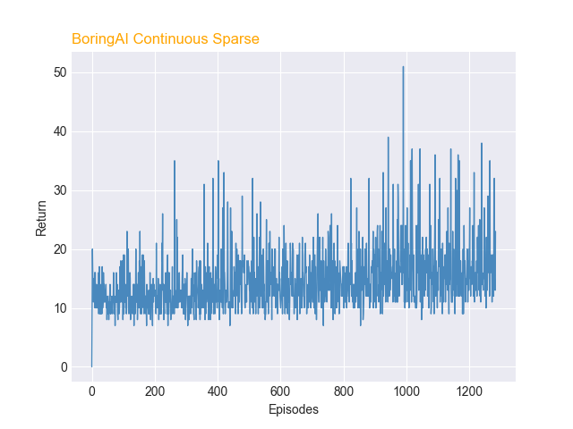 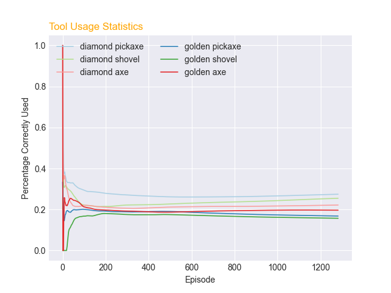  


#### Baselines (for Phase 2)
**Q**: So how did the agent actually do, according to the baselines?  
A “perfect” run, with equal parts dirt, stone, and wood blocks, takes a speed of roughly 70 BPM. Our agents consistently reached upwards of 50 BPM.

**Q**: How do you know it didn’t just get lucky?  
We know it wasn’t just chance because our baseline determined that a random agent operates at around 24 BPM,. Our final results were much higher. However, it is interesting to note that, for roughly the first couple hundred episodes, the agent was by this measure a random agent. Thus, its gradual improvement proves it wasn’t just lucky.

But we have other baselines help to prove that it wasn’t just luck that increased the agent’s performance. While there were definitely times where we observed a rare “lucky tunnel” made up almost completely of dirt (the easiest block to dig), we can confidently say that our model did not simply get caught only using “the best tool”. (Note: we eventually implemented tunnels with consistently equal, but shuffled, block composition to further reduce the role of chance)

  
<p align="center">
<table style="margin:0px auto;border-collapse:collapse;border-spacing:5;" >
<tr>
<th style="padding: 5px; border: 1px solid #DCDCDC; border-collapse: collapse;">Baseline</th>
<th style="padding: 5px; border: 1px solid #DCDCDC; border-collapse: collapse;">Blocks Per Minute</th>
</tr>
<tr>
<td style="padding: 5px; border: 1px solid #DCDCDC; border-collapse: collapse;background-color: #f2f2f2;">Random Agent</td>
<td style="padding: 5px; border: 1px solid #DCDCDC; border-collapse: collapse;background-color: #f2f2f2;">24.17</td>
</tr>
<tr>
<td style="padding: 5px; border: 1px solid #DCDCDC; border-collapse: collapse;">Only Pickaxe</td>
<td style="padding: 5px; border: 1px solid #DCDCDC; border-collapse: collapse;">36.8</td>
</tr>
<tr>
<td style="padding: 5px; border: 1px solid #DCDCDC; border-collapse: collapse;background-color: #f2f2f2;">Only Shovel</td>
<td style="padding: 5px; border: 1px solid #DCDCDC; border-collapse: collapse;background-color: #f2f2f2;">19.6</td>
</tr>
<tr>
<td style="padding: 5px; border: 1px solid #DCDCDC; border-collapse: collapse;">Only Axe</td>
<td style="padding: 5px; border: 1px solid #DCDCDC; border-collapse: collapse;">22.8</td>
</tr>
<tr>
<td style="padding: 5px; border: 1px solid #DCDCDC; border-collapse: collapse;background-color: #f2f2f2;">Perfect Agent</td>
<td style="padding: 5px; border: 1px solid #DCDCDC; border-collapse: collapse;background-color: #f2f2f2;">69.9</td>
</tr>
</table>
</p>


#### Tool Stats (for Phase 2)


**PPO vs DQN Tool Usage** \
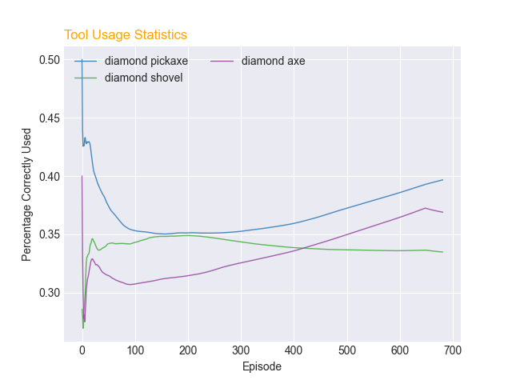 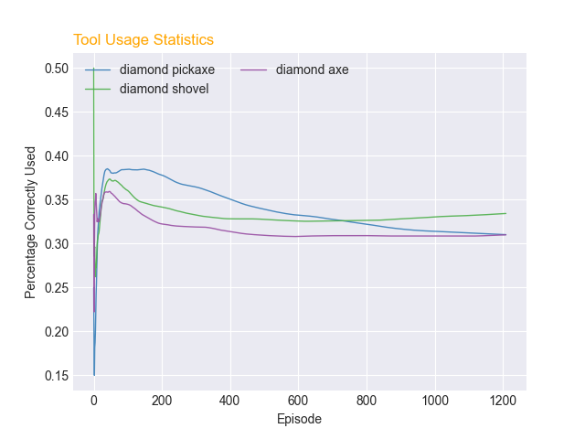  

**Q**: The rates are going up, is that good?  
Not necessarily. The Toolstats divide the number of correct uses, divided by the overall number of uses. So a pick might be used 5 times, but only be used correctly 2 times, resulting in a correct-usage-rate of 40%. So here’s the catch: If the pickaxe was used exclusively, it would have a correct-usage-rate of only 33%. However, it would have been used to get through some of the slowest blocks, overall resulting in a faster agent. All that being said, higher rates are generally better.

**Q**: So what good is it then?  
The main thing we used this graph for was to determine if it was approaching that perfect-usage. Logically, if the agent was perfect, the correct-usage-rate would be 100% for each tool. However, do rates below 100% mean the agent is failing? One thing this graph also told is that the agent begins to use the pickaxe and axe more over time, which we didn’t expect. We can also compare it to the DQN, whose correct-usage-rates stayed relative equal, indicating it wasn't making the same decisions as the PPO agent.

**Q**: So, did the agent improve? How do they compare?  
Yes, but not as intended. From watching the agent during training, and inferring from the tools usage, we can confidently say that the agent got faster. However, it didn’t learn to get faster by using the correct tools every time. Instead, it learned to use the correct tool for the slowest blocks, while remaining okay with incurring the small penalty for digging quick blocks with the wrong tools (i.e. digging dirt with an axe). 

Overall, our agent improved quantitatively. But qualitatively is a separate question.

### Qualitative
**Q**: Statistics aside, did it look like it was doing what you wanted?  
It definitely didn’t learn how we intended. We thought it was going to learn which tool goes to what, like a human would. But instead, it seemed more like it was learning which tools to not use. 

In support of this, we also observed that the agent always seemed to do well near the beginning and end of the episode. While struggling the most near the middle of the tunnel. This was more apparent in the longer tunnel. Because of the nature of our state, there are not many things we can qualitatively measure. 

### Conclusion: Did We Solve Our Problem?
<p align="center">
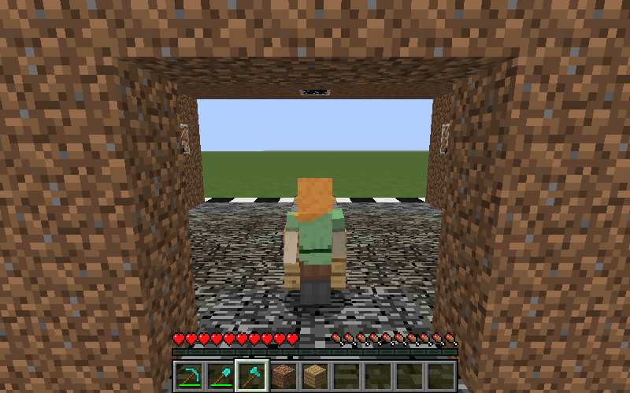
</p>
In short, it didn't learn what we wanted, or the way we wanted. Why? Because it’s much harder to train a model with sparse rewards in a continuous environment than with dense rewards in a discrete environment. 

Quantitatively, our agent was, without a doubt, learning to use tools more effectively. But qualitatively, it displayed unintended behavior that we didn’t expect, or want. Yes, improvement is improvement. But our goal was to teach the model to learn the correct tools, and then as a result be fast. Instead, it seemed more focused on avoiding slow strategies, not tool mastery.

Thus, we deem our project a mild success. It didn’t meet our expectations qualitatively, but it learned how to go fast - just not in the way we had hoped. 

## References
RLlib - algorithms\
PyTorch - algorithms\
Tqdm - testing\
Matplotlib - graphing\
iMovie - video editing

Links\
https://spinningup.openai.com/en/latest/algorithms/ppo.html \
https://storage.googleapis.com/deepmind-media/dqn/DQNNaturePaper.pdf
