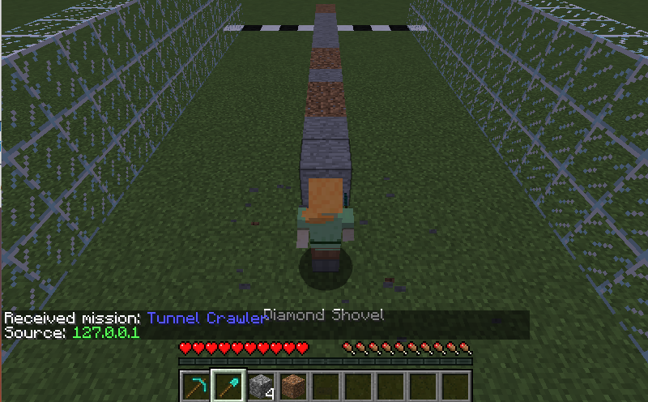

### Long Ago...
There lived two lovers, Steve and Alex. Their romantic tale is passed down through this song below...
```
  Two lovers, forbidden from one another
  A war divides their people
  And a mountain divides them apart   
  Built a path to be together
  ...Yeah, and I forget the next couple of lines, but then it goes...
  Secret tunnel!
  Secret tunnel!
  Through the mountain!   
  Secret, secret, secret, secret tunnel!"
```
*- Eisen, Zach T, Mae Whitman, Jack DeSena, Dante Basco, Dee B. Baker, Mako, and Melendy Britt. Avatar, the Last Airbender. , 2015.*




### The Problem Space
Our AI, Steve, has to dig a tunnel to reach his lover, but wants to get to the end as fast as possible using his limited amount of tools.
He will have to learn which tools dig the fastest through dirt and stone
Check out our source code here: https://github.com/Modjular/boringAI

Reports:

- [Proposal](proposal.html) 
- [Status](status.html) 
- [Final](final.html) (TBD)

### Our Name
"Boring" is a synonym of "digging". Steve, once trained, will use his skills to bore through the mountain and reach his love. 
