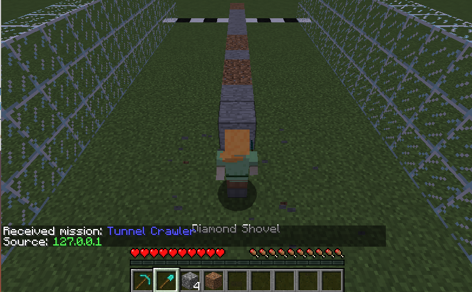
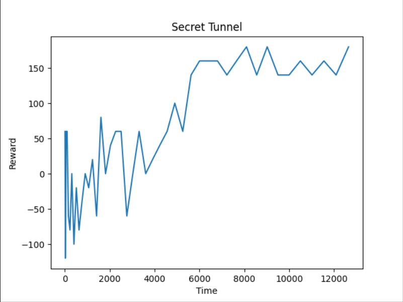

## Project Summary
In Minecraft, certain tools mine through blocks faster than others (i.e. pickaxes destroy stone-blocks faster than shovels). We aim to train a Minecraft agent using deep reinforcement learning to dig to the end of a tunnel as fast as possible, by learning what tools are best for each material it encounters. Ideally, our AI will learn to use the proper tool to destroy the block, for maximum tunneling speed. For our prototype, we concentrated on the switching to the right tool. To do so, we limited our malmo environment to discrete movements and used dense rewards. For our finished project, we plan on incorporating sparse rewards based on time, instead of dense, direct rewards

## Approach



For each mission, our agent is spawned with 20 different types of blocks lined in front of him as seen in the picture above. To complete the mission, he has to reach the finish line by destroying the blocks in front of him, using one of the tools in the hotbar ( shovel or pickaxe).  

To train our agent, we are implementing a deep reinforcement learning algorithm, using rlLib with default parameters. Since our AI is bulldozing through in a straight line, our action space is limited to choosing between a diamond pickaxe and diamond shovel. When the agent encounters a block in front of itself, it chooses a tool. Afterwards, the agent follows a command sequence of breaking the block and moving forward. The agent repeats this cycle until it has reached the end of the tunnel, which is denoted by the coal block. Our observation state includes the 3x3 block space surrounding the agent. 

In our prototype, we have 2 different tools (pickaxe and shovel) with 2 different blocks (dirt and stone). For our prototype’s rewarding function, we’re using dense rewards. We have direct rewards at each step (+10 for using the right tool, -10 for not), to make sure that the agent functions correctly. For future implementations, we will try to use sparse rewards to train the agent. 

```
if get_block_front(world_state) == 'dirt':
  if action_idx == 0: # switching to pickaxe
    reward += -10
  else:
    reward += 10
elif get_block_front(world_state) == 'stone':
  if action_idx == 1: #switching to shovel
    reward += 10
  else:
    reward += -10
```


## Evaluation
### Quantitative
Our baseline is a random agent - randomly swapping tools while digging the tunnel, which should result in the right tool only 50% of the time (since we only have 2 different tools). Because our reward/penalty are equal magnitude, that should result in a final return of 0.

We evaluate our AI by generating a graph of reward versus time (or steps). As the agent trains longer, we expect the graph to have an upward trend. 


Above is a graph created from our prototype, showing a positive correlation between the number of steps and the reward, indicating improvement in our AI. 

### Qualitative
Although our metrics are straightforward, our sanity check is changing tools in response to its environment. Qualitatively, we can check that it’s using the right tool (shovel) to dig through dirt. Because of the nature of our state, there are not many things we can qualitatively measure. But perhaps we will discover qualitative metrics as we progress and attempt to add more difficult states.

After incorporating time, our metric will be based on the time it takes for the agent to dig a 20 block straight tunnel through a mountain made up of different types of blocks. 

## Remaining Goals and Challenges:
### Goals
Our next stage is to incorporate time into the reward system instead of using discrete movements for breaking blocks. We also plan on using more than two different types of blocks and tools. Our moonshot is incorporating the durability of the tool as a factor for the reward algorithm of our AI. We would provide our AI with different types of the same tool (e.g. diamond pickaxe, wooden pickaxe) and try to train the AI to not break any tools. Another moon shot would be adding a dimension so that the agent has a choice to circle around tough blocks instead of bulldozing through and avoiding lava blocks.

### Challenges
Additional challenges include figuring out the best algorithms to use from RLlib, and fine tuning our hyperparameters.

## Resources Used
RLlib - algorithms\
PyTorch - algorithms\
Tqdm - testing\
Matplotlib - graphing\
iMovie - video editing
